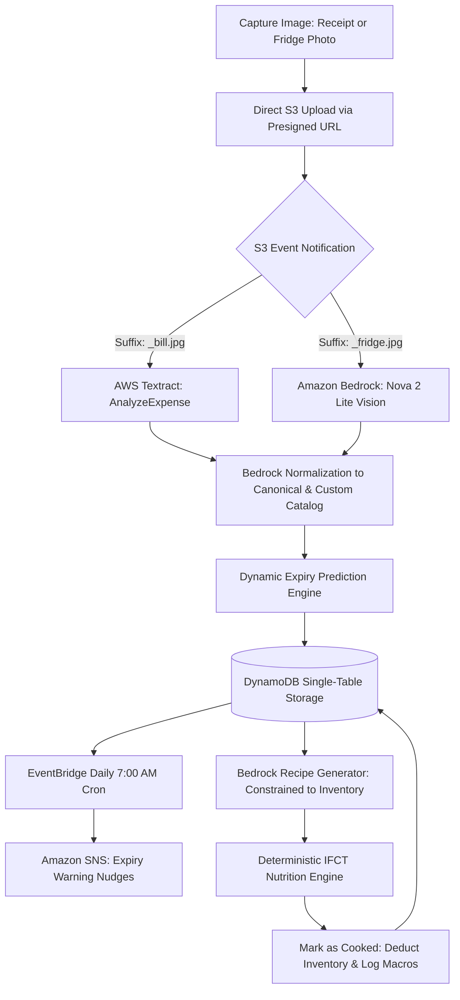

# UseItUp — AI-Powered Kitchen Intelligence & Food Waste Reduction System

> **A persistent, proactive kitchen operating system that tracks household inventory, predicts food expiry, and generates zero-waste recipes with deterministic Indian Food Composition Tables (IFCT) nutrition.**

[](https://aws.amazon.com/)
[](https://aws.amazon.com/bedrock/)
[](https://aws.amazon.com/textract/)
[](https://aws.amazon.com/dynamodb/)
[-3776AB?logo=python)](https://www.python.org/)
[](https://vitejs.dev/)
[](https://docs.pytest.org/)

---

## Pitch: Why UseItUp?

Stateless conversational chatbots (such as ChatGPT) can identify ingredients from an image when asked, but they immediately lose context when the user closes their browser tab. They have no concept of persistent fridge inventory, no scheduled awareness of food aging on the shelf, and no ability to proactively warn users before items spoil.

**UseItUp is a proactive kitchen intelligence system:**
1. **It Remembers:** Multi-modal inputs (crumpled thermal grocery receipts and fridge photos) are extracted into an atomic, persistent single-table DynamoDB inventory with purchase dates, estimated quantities, and shelf-life tracking.
2. **It Predicts Proactively:** An automated daily EventBridge cron evaluates ingredient life cycles and triggers Amazon SNS notifications to nudge users before perishable items spoil.
3. **It Generates Constrained Recipes:** Recipes are strictly derived from what is *currently* available in the household pantry, respecting dietary restrictions (Vegetarian, Non-Veg, Jain, Vegan, Eggetarian) without asking users to buy missing items.
4. **Deterministic Nutrition:** Instead of relying on hallucinated macro estimations from an LLM, macro calculations (calories, protein, carbohydrates, fats, fiber) are computed deterministically using the official **Indian Food Composition Tables (IFCT 2017, ICMR-NIN)**.
5. **Closed-Loop Feedback:** Marking a recipe as cooked deducts the exact ingredient quantities from the database and commits nutritional metrics to the household's daily dietary progress.

---

## Table of Contents

- [Problem Statement](#problem-statement)
- [Solution & User Journey](#solution--user-journey)
- [System Architecture](#system-architecture)
- [Key Features](#key-features)
- [Multi-Modal AI Pipeline](#multi-modal-ai-pipeline)
- [Single-Table DynamoDB Schema](#single-table-dynamodb-schema)
- [Deterministic Nutrition (IFCT 2017)](#deterministic-nutrition-ifct-2017)
- [Technology Stack](#technology-stack)
- [Repository Structure](#repository-structure)
- [API Reference](#api-reference)
- [Getting Started](#getting-started)
- [Automated Testing](#automated-testing)
- [Hackathon Evaluation Guide](#hackathon-evaluation-guide)

---

## Problem Statement

* **Scale of Food Waste:** India produces an abundance of agricultural yield, yet approximately 40% of food produced is wasted annually across supply chains and consumer kitchens—amounting to an economic loss of roughly \$14 billion USD each year.
* **Household Invisibility:** Over 65% of households do not maintain an inventory of what is inside their refrigerator or pantry. Items placed in crisper drawers, half-used produce, and dairy products are often forgotten until they spoil.
* **The "What's for Dinner?" Dilemma:** Consumers routinely default to ordering takeout or cooking meals requiring new grocery purchases, ignoring ingredients on the brink of expiry in their own kitchens.
* **The OCR / Tracking Friction:** Manually logging grocery items into mobile apps is tedious and quickly abandoned. Traditional OCR scanners struggle with thermal receipts, crumpled paper, brand aliases, and regional Indian ingredient naming conventions (e.g., *dhania*, *tamatar*, *atta*, *aloo*).

---

## Solution & User Journey

UseItUp transforms kitchen management into a seamless, automated loop:



1. **Capture:** The user snaps a thermal grocery bill or takes a photo of their open fridge.
2. **Intelligent Ingestion:** S3 upload triggers asynchronous processing via AWS Textract and Amazon Bedrock (Amazon Nova 2 Lite). Raw OCR names and visual objects are normalized against a canonical catalog of Indian kitchen staples plus user-configured custom items.
3. **Shelf-Life Prediction:** Purchase dates and conservative visual heuristics compute predicted expiry dates.
4. **Proactive Alerts:** If coriander or paneer is 48 hours from spoiling, an EventBridge cron sends an SMS/email notification via SNS suggesting recipes to use it up today.
5. **Cook & Update:** Selecting a recipe shows ingredients, step-by-step instructions, and exact macros. Tapping **"Mark as Cooked"** updates inventory levels and tracks daily nutritional targets.

---

## System Architecture

The solution uses a completely event-driven, serverless architecture deployed on AWS via AWS SAM (CloudFormation):

```mermaid
flowchart TB
    subgraph Client [Frontend Client: Vite + Vanilla JS]
        UI_Hero[Scroll-Scrubbed Canvas Hero: GSAP ScrollTrigger]
        UI_Console[App Console: Upload, Inventory, Recipes & Nutrition]
    end

    subgraph CDN [Content Delivery]
        CF[Amazon CloudFront: Edge Caching for 192 Animation Frames]
    end

    subgraph API_Tier [API Gateway & Storage]
        APIGW[Amazon API Gateway: REST API /dev]
        S3_Uploads[Amazon S3: useitup-uploads-dev]
    end

    subgraph Lambda_Tier [Compute: 11 AWS Lambda Functions Python 3.12 / arm64]
        L_UploadUrl[GetUploadUrlFunction - POST /upload-url]
        L_IngestBill[IngestBillFunction - S3 Trigger _bill.jpg]
        L_IngestFridge[IngestFridgePhotoFunction - S3 Trigger _fridge.jpg]
        L_AddInv[AddInventoryFunction - POST /inventory]
        L_GetInv[GetInventoryFunction - GET /inventory]
        L_DelInv[DeleteInventoryFunction - DELETE /inventory]
        L_Recipes[GenerateRecipesFunction - POST /recipes/generate]
        L_Nutrition[GetNutritionSummaryFunction - GET /nutrition]
        L_Cooked[MarkCookedFunction - POST /cooked]
        L_Profile[UpdateProfileFunction - PUT /profile]
        L_Cron[ExpiryCheckCronFunction - Scheduled 01:30 UTC]
    end

    subgraph AIServices [AWS AI & Managed Services]
        Textract[AWS Textract: AnalyzeExpense]
        Bedrock[Amazon Bedrock: Nova 2 Lite]
        EventBridge[Amazon EventBridge Rule: Daily Expiry Schedule]
        SNS[Amazon SNS: UseItUp-expiry-nudges-dev]
    end

    subgraph Storage [Persistent State]
        DDB[(Amazon DynamoDB: Single-Table UseItUp-dev)]
    end

    UI_Hero -.->|Preload Frames| CF
    UI_Console -->|REST API Calls| APIGW
    UI_Console -->|Direct S3 PUT| S3_Uploads

    APIGW --> L_UploadUrl
    APIGW --> L_AddInv
    APIGW --> L_GetInv
    APIGW --> L_DelInv
    APIGW --> L_Recipes
    APIGW --> L_Nutrition
    APIGW --> L_Cooked
    APIGW --> L_Profile

    S3_Uploads -->|ObjectCreated| L_IngestBill
    S3_Uploads -->|ObjectCreated| L_IngestFridge

    L_IngestBill --> Textract
    L_IngestBill --> Bedrock
    L_IngestFridge --> Bedrock
    L_Recipes --> Bedrock

    EventBridge --> L_Cron
    L_Cron --> SNS

    L_UploadUrl --> DDB
    L_IngestBill --> DDB
    L_IngestFridge --> DDB
    L_AddInv --> DDB
    L_GetInv --> DDB
    L_DelInv --> DDB
    L_Recipes --> DDB
    L_Nutrition --> DDB
    L_Cooked --> DDB
    L_Profile --> DDB
    L_Cron --> DDB
```



---

## Key Features

### 1. Dual Image Ingestion Engine
* **Grocery Bill Processing (`IngestBillFunction`):** Uses AWS Textract AnalyzeExpense API to parse thermal receipts, extracting line items, prices, and quantities. Textract items are normalized via Amazon Nova 2 Lite into canonical ingredient IDs.
* **Fridge Content Recognition (`IngestFridgePhotoFunction`):** Leverages Amazon Nova 2 Lite Vision directly via the Bedrock Converse API to detect visible ingredients and estimate gram weights.
* **Direct-to-S3 Uploads:** Files are uploaded directly from the browser to Amazon S3 via presigned PUT URLs, eliminating heavy payload bottlenecks through API Gateway.

### 2. Dynamic Catalog & Custom Valid Items Space
* **22 Core Indian Staples:** Pre-configured with bilingual aliases (Hindi/English, e.g., *tamatar*, *dhania*, *atta*, *aloo*), shelf lives, and complete nutritional profiles.
* **Custom Allowed Items:** A dedicated configuration field allows users to add custom valid items (e.g., `bread, cheese, apple, almonds, pasta`).
* **Validation Barrier:** During bill or photo scans, items must match either the 22-item catalog or the user's custom valid items list. Unrecognized non-food items or invalid entries are automatically filtered out.

### 3. Smart Async Background Polling
* S3 ingestion is decoupled from the user request.
* The frontend client features active progress tracking that polls the inventory endpoint every 3 seconds (up to 36 seconds) with real-time status messages (`Analyzing image with AI (checking 3/12)...`), automatically rendering ingredients the moment Lambda extraction completes.

### 4. Proactive Expiry Nudges (EventBridge + SNS)
* Every morning at 7:00 AM IST (01:30 UTC), an EventBridge cron invokes `ExpiryCheckCronFunction`.
* The function scans inventory for items expiring within 48 hours, formats a personalized alert, and publishes it to an Amazon SNS topic for SMS/email push.

### 5. Inventory-Constrained Recipe Generator
* The recipe generator strictly restricts Bedrock to produce recipes that can be prepared using **only** currently available ingredients.
* Users can specify meal type (*lunch, dinner, breakfast, snack*) and prep time (*15m, 30m, 45m+*).
* Recipes respect household dietary constraints: Vegetarian, Non-Vegetarian, Vegan, Jain (omits root vegetables like onion, garlic, potato), and Eggetarian.

### 6. Closed-Loop Inventory Deduction & Meal Tracking
* Clicking **"Mark as Cooked"** executes an atomic transaction in DynamoDB:
  - Deducts recipe ingredient quantities from the household's current inventory.
  - Automatically deletes items whose remaining quantity drops to zero.
  - Commits the meal to daily consumed nutrition totals.

### 7. Scroll-Scrubbed Cinematic Landing Experience
* The landing page features a 192-frame cinematic canvas sequence inspired by Apple product storytelling.
* Built using GSAP ScrollTrigger, preloading frames from AWS CloudFront to deliver 60 FPS scroll-bound scrubbing across all modern viewports.

---

## Multi-Modal AI Pipeline

UseItUp utilizes **Amazon Nova 2 Lite** (`global.amazon.nova-2-lite-v1:0`) through the **Amazon Bedrock Runtime Converse API**:

| Task | Input | Model / Service | Output Format |
|---|---|---|---|
| **Receipt OCR** | Image bytes (JPEG/PNG) | AWS Textract (`AnalyzeExpense`) | Structured expense blocks |
| **Receipt Normalization** | Raw OCR line items + Catalog | Amazon Nova 2 Lite (Text) | Valid JSON Array of `ingredient_id` and `quantity_g` |
| **Fridge Vision** | Photo bytes (JPEG) + Prompt | Amazon Nova 2 Lite (Vision) | Valid JSON Array of visible ingredients |
| **Recipe Generation** | Inventory items + Diet preferences | Amazon Nova 2 Lite (Text) | Structured JSON Recipe objects with steps and gram quantities |

### Bedrock Reliability & Guardrails
* **Deterministic Low Temperature (`0.2`):** Used across all generation tasks to prevent hallucinations and maintain strict catalog conformance.
* **Converse API Integration:** Single unified schema across text and vision invocations.
* **Automatic JSON Retry Loop:** Bedrock output is strictly validated against Pydantic models. If invalid JSON or Markdown wrappers are encountered, the client automatically executes an immediate retry with an enforced format constraint.
* **Byte Constraints:** Vision payloads are checked against the ~3.75 MB Bedrock inline image ceiling before invocation.

---

## Single-Table DynamoDB Schema

All entities are organized in a single DynamoDB table (`UseItUp-dev`) using partition keys (`PK`) and sort keys (`SK`):

| Entity | PK | SK | Attributes / Purpose |
|---|---|---|---|
| **Household Profile** | `HH#{household_id}` | `PROFILE` | `diet_type`, `household_size`, `daily_calorie_target`, `daily_protein_target`, `additional_valid_ingredients` |
| **Inventory Item** | `HH#{household_id}` | `ITEM#{ingredient_id}_{timestamp}` | `quantity_g`, `purchase_date`, `predicted_expiry`, `expiry_confidence`, `source` |
| **Cooked Meal** | `HH#{household_id}` | `COOKED#{timestamp}` | `recipe_name`, `ingredients_used`, `nutrition_totals`, `cooked_at` |
| **Upload State** | `HH#{household_id}` | `UPLOAD#{image_id}` | `status` (`pending`/`processed`), `upload_type`, `item_count`, `created_at` |
| **Catalog Item (Optional)** | `CAT#{ingredient_id}` | `META` | Canonical metadata, IFCT macros per 100g, aliases |

* **Global Secondary Index (GSI1):** `GSI1PK = CAT#{ingredient_id}`, `GSI1SK = {household_id}` allows querying which households currently possess a specific ingredient.

---

## Deterministic Nutrition (IFCT 2017)

Unlike typical AI nutrition apps that query an LLM for calorie estimates (often producing widely fluctuating figures), UseItUp calculates all nutritional information deterministically.

Nutritional data is sourced from the **Indian Food Composition Tables (IFCT 2017)** compiled by the **National Institute of Nutrition (ICMR-NIN)**:

* **Energy (kcal)**
* **Protein (g)**
* **Carbohydrates (g)**
* **Fat (g)**
* **Dietary Fiber (g)**

$$\text{Total Macro} = \sum_{i=1}^{n} \left( \frac{\text{Quantity of Ingredient } i \text{ (grams)}}{100} \times \text{Macro per 100g of Ingredient } i \right)$$

$$\text{Per Serving Macro} = \frac{\text{Total Macro}}{\text{Servings}}$$

---

## Technology Stack

| Layer | Technology | Rationale |
|---|---|---|
| **Frontend UI** | Vanilla JS (ES Modules) + Vite | Ultra-lightweight, zero bundle overhead, rapid loading |
| **Animation Engine** | GSAP 3.15 + ScrollTrigger | High-performance 60 FPS canvas frame-by-frame scrub |
| **CDN / Assets** | Amazon CloudFront + Amazon S3 | Edge delivery for 192 high-resolution pre-rendered frames |
| **API Gateway** | AWS API Gateway (REST API) | Fully managed endpoint routing with CORS |
| **Compute** | AWS Lambda (Python 3.12, arm64) | Event-driven microservices, sub-second billing, zero idle cost |
| **AI / Multimodal** | Amazon Bedrock (Nova 2 Lite) | Fast, cost-efficient multimodal reasoning and vision |
| **Document AI** | AWS Textract | Specialized OCR for unstructured receipts and expense items |
| **Database** | Amazon DynamoDB | Single-digit millisecond latency single-table storage |
| **Scheduled Tasks** | Amazon EventBridge Rules | Reliable cron scheduling for automated daily expiry scans |
| **Notifications** | Amazon Simple Notification Service (SNS) | Scalable pub/sub notification delivery for expiry alerts |
| **Infrastructure as Code** | AWS Serverless Application Model (SAM) | Reproducible, version-controlled CloudFormation templates |
| **Test Framework** | Pytest, AnyIO, Faker | Comprehensive unit and integration test suite |

---

## Repository Structure

```
BharatHack/
├── DEPLOYMENT.md                  # Comprehensive end-to-end deployment documentation
├── Novelty.md                     # Technical differentiators & problem analysis
├── how to use this project.md     # Step-by-step user and operator guide
├── readMe.md                      # Project documentation and hackathon submission overview
└── UseItUp/                       # Primary Application Workspace
    ├── index.html                 # Main application UI (Landing Page + App Console)
    ├── style.css                  # Landing page presentation and layout styling
    ├── package.json               # Frontend dependencies (Vite, GSAP)
    ├── src/
    │   ├── api.js                 # Frontend API client library
    │   ├── app.js                 # App console controller, async polling, UI state
    │   ├── app.css                # Dark-mode dashboard styling and component layout
    │   ├── heroScrollSequence.js  # GSAP ScrollTrigger canvas scrub controller
    │   └── main.js                # Frontend bootstrap entry point
    └── backend/                   # Serverless AWS Backend
        ├── template.yaml          # AWS SAM infrastructure definition (11 Lambdas, DDB, S3, SNS)
        ├── samconfig.toml         # SAM deployment configuration (ap-south-1, UseItUp-dev)
        ├── requirements.txt       # Python dependencies (boto3, pydantic)
        ├── src/
        │   ├── functions/         # AWS Lambda function handlers
        │   │   ├── add_inventory/
        │   │   ├── delete_inventory/
        │   │   ├── expiry_check_cron/
        │   │   ├── generate_recipes/
        │   │   ├── get_inventory/
        │   │   ├── get_nutrition_summary/
        │   │   ├── get_upload_url/
        │   │   ├── ingest_bill/
        │   │   ├── ingest_fridge_photo/
        │   │   ├── mark_cooked/
        │   │   └── update_profile/
        │   └── shared/            # Common domain logic and AWS SDK wrappers
        │       ├── bedrock_client.py       # Converse API client with retry logic
        │       ├── constants.py            # Key schemas, prefix constants, defaults
        │       ├── dynamo_client.py        # Single-table DynamoDB helper functions
        │       ├── expiry_predictor.py     # Shelf-life computation engine
        │       ├── ingredient_catalog.py   # 22-item IFCT database & lookup helpers
        │       ├── models.py               # Pydantic data models & request schemas
        │       ├── nutrition_calculator.py # Deterministic IFCT nutritional math
        │       └── textract_client.py      # Textract AnalyzeExpense parser
        └── tests/
            └── unit/              # 95 automated unit tests
```

---

## API Reference

All requests and responses use JSON. Requests are routed through Amazon API Gateway:

| Method | Route | Description | Request Body / Query |
|---|---|---|---|
| `POST` | `/upload-url` | Generate presigned S3 PUT URL | `{"household_id": "hh-demo", "upload_type": "bill" \| "fridge_photo"}` |
| `GET` | `/inventory` | Fetch current household inventory | `?household_id=hh-demo` |
| `POST` | `/inventory` | Manually add single ingredient | `{"household_id": "hh-demo", "ingredient_id": "tomato", "quantity_g": 300}` |
| `DELETE` | `/inventory` | Remove ingredient record | `{"household_id": "hh-demo", "item_sk": "ITEM#tomato_..."}` |
| `POST` | `/recipes/generate` | Generate inventory-constrained recipes | `{"household_id": "hh-demo", "meal_type": "dinner", "max_time_mins": 30}` |
| `POST` | `/cooked` | Deduct ingredients & record cooked meal | `{"household_id": "hh-demo", "recipe_name": "...", "ingredients_used": [...]}` |
| `GET` | `/nutrition` | Get daily consumed macros vs targets | `?household_id=hh-demo` |
| `PUT` | `/profile` | Update household targets & custom items | `{"household_id": "hh-demo", "additional_valid_ingredients": ["bread", "cheese"]}` |

---

## Getting Started

### 1. Prerequisites
* **Node.js:** v18.0 or higher
* **Python:** 3.12 (with pip)
* **AWS CLI:** Configured with active AWS credentials (`aws configure`)
* **AWS SAM CLI:** Installed for serverless packaging and deployment
* **Docker:** Required for cross-compiling ARM64 Lambda containers locally

### 2. Running Frontend Locally
```bash
cd UseItUp
npm install
npm run dev
```
Open `http://localhost:5173`. Scroll to explore the 192-frame hero sequence. Press `Ctrl + Shift + D` or append `?debug` to view the connection panel and link your deployed backend.

### 3. Deploying the Backend
```bash
cd UseItUp/backend
sam build
sam deploy --no-confirm-changeset
```

After deployment completes, copy the `ApiEndpoint` output from CloudFormation:
```bash
sam list stack-outputs --stack-name UseItUp-dev
```
Paste this endpoint into your frontend `.env` file or directly into the **1 · Connection** panel in the app.

---

## Automated Testing

The backend includes 95 automated unit tests covering Bedrock invocations, Textract extraction, DynamoDB serializations, expiry logic, and catalog validations.

To run the full test suite:
```bash
cd UseItUp/backend
python -m pytest
```

Expected output:
```text
============================= 95 passed in 0.86s ==============================
```

---

## Hackathon Evaluation Guide

| Criterion | How UseItUp Delivers |
|---|---|
| **Technical Depth** | Multi-service AWS architecture: 11 Lambda microservices, S3 event triggers, DynamoDB single-table design, EventBridge crons, and SNS pub/sub. |
| **Real-World Impact** | Directly targets the \$14B annual food-waste crisis in India with automated tracking, personalized shelf-life nudges, and localized recipe generation. |
| **AI Innovation** | Uses multi-modal AI appropriately: Textract for document parsing, Bedrock Vision for image recognition, and Bedrock Text for inventory-constrained generation. |
| **Scientific Precision** | Nutritional calculations avoid model hallucinations by using deterministic mathematics grounded in ICMR-NIN Indian Food Composition Tables (IFCT 2017). |
| **User Experience** | Features an Apple-inspired 192-frame cinematic canvas scroll, coupled with responsive dark-mode dashboard controls and real-time async polling. |

---

## License

This project is submitted for the BharatHack Hackathon. All rights reserved.
